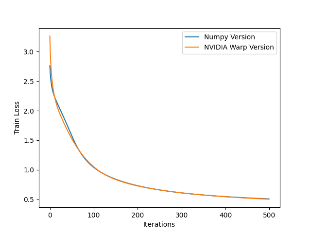

This repo is a revision on the mathematics behind neural networks, built from scratch to revise my basic knowledge on neural networks.

Run the project with 
```
uv sync
uv run main -np -wp
```

The flags -np and -wp correspond to the numpy and NVIDIA warp neural network models. Both generate loss graphs, to check how the (from scratch) neural network is fairing.
Obviously the flags -np and -wp can be run separately.

Results:


```
Warp 1.17.0 initialized:
   CUDA Toolkit 12.9, Driver 13.0
   Devices:
     "cpu"      : "x86_64"
     "cuda:0"   : "Tesla T4" (15 GiB, sm_75, mempool enabled)
   Kernel cache:
     /root/.cache/warp/1.17.0
Module warp_version 5df6ac9 load on device 'cuda:0' took 3635.49 ms  (compiled)
--------------------NUMPY Neural Network TRAINING--------------------
training: 100% 500/500 [02:19<00:00,  3.59it/s, acc=0.8462, loss=0.507]
---------------------------------------------------------------------
--------------------NUMPY Neural Network TESTING---------------------
Test Accuracy: 0.856
Test Loss: 0.48052479028828554
---------------------------------------------------------------------
-----------------NVIDIA WARP Neural Network TRAINING-----------------
training: 100% 500/500 [00:21<00:00, 23.04it/s, acc=0.8486, loss=0.502]
---------------------------------------------------------------------
-----------------NVIDIA WARP Neural Network TESTING------------------
Test Accuracy: 0.8513
Test Loss: 0.48413125
---------------------------------------------------------------------
```
